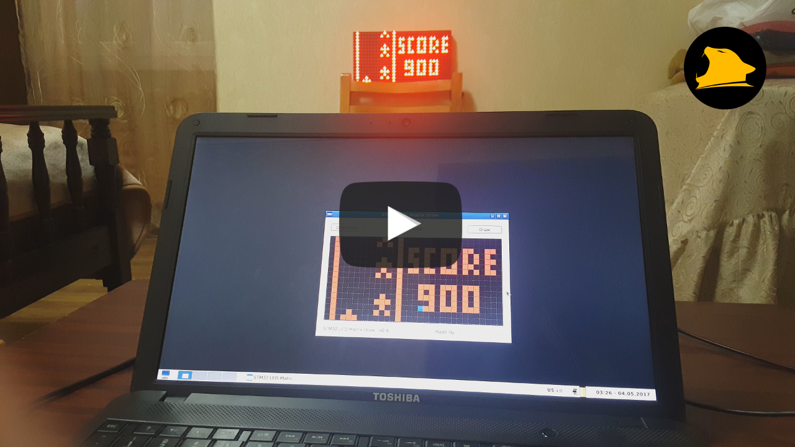
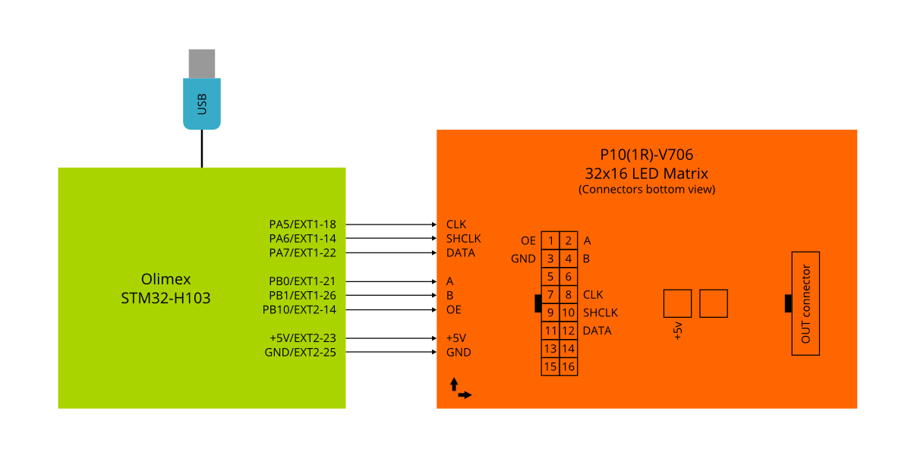
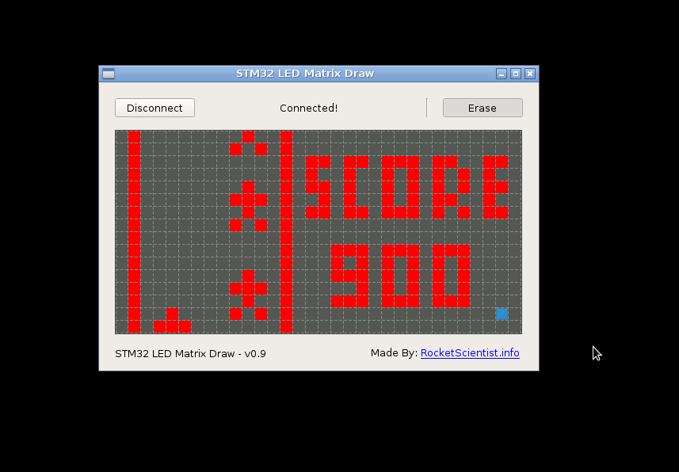

[](https://www.youtube.com/watch?v=PMLNQ5mM47Y)
# STM32 USB Led Matrix Real Time Drawing

#### YouTube video URL: https://www.youtube.com/watch?v=PMLNQ5mM47Y

#### code https://github.com/OleKN/STM32_USB_Led_Matrix_RealTime_Drawing

### Modules connection


### Qt/C++ drawing app


:grey_exclamation:USB device is detected by Vendor ID and Product ID

#### code https://github.com/OleKN/STM32_USB_Led_Matrix_RealTime_Drawing

#### YouTube video URL: https://www.youtube.com/watch?v=PMLNQ5mM47Y

``` cpp
sudo apt install qtcreator
sudo apt install qt5-default
sudo apt install qt5-qmake
sudo apt install libqt5serialport5-dev
```
